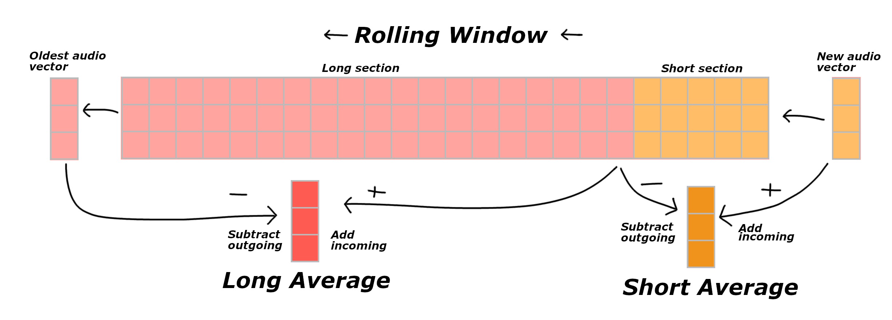

## Realtime Audio Segmentation

The real-time audio segmentation algorithm described here is specifically developed to address the need for dynamic and coherent visual effects in audio reactive LED lighting systems. The goal is to create visually engaging displays that change and flow with the music. This algorithm segments the real-time audio into coherent sections and provides a signal when a change in the song occurs.

## Features

- **Real-time**: The algorithm processes the audio in real-time, allowing it to respond to changes in the music as they occur.
- **Coherent**: The algorithm segments the audio into coherent sections that are consistent with the music. Sometimes it might miss a section or detect a section that is not present, but overall, the sections are consistent enough with the music to create a pleasing visual effect.
- **Lightweight**: The algorithm is lightweight and can be implemented on microcontrollers such as the ESP32. It is also highly optimized to minimize computational load.

<!-- centred badges -->

<!-- a badge showing build status -->

<!-- A badge linking to the github pages site saying Live Demo - Try it out! -->

## Algorithmic Outline

1. **Frame-based analysis**: The audio is processed frame by frame in real-time. Each frame represents a short segment of the audio signal. The frame size is typically 512 samples, which corresponds to 11.6 ms at a sampling rate of 44.1 kHz. The frame size can be adjusted to fit the existing system requirements with little detriment to the algorithm's performance.
2. **Feature extraction**: Calculate audio features for each frame that capture general characteristics of the sound. Effective features include Low-Frequency Content (LFC), Energy, and Zero-Crossing Rate (ZCR). LFC is computed from the frequency spectrum obtained through FFT, while Energy and ZCR are calculated directly from the raw audio frame. These features are combined into a three-dimensional feature vector.
3. **Averaging**: Rolling averages are used to compare the current sounds to the previous sounds heard in the last few seconds. A rolling window is maintained, and for each frame, the feature vector is added to the start of the rolling window while discarding the oldest vector. Short and long averages are computed from the rolling window. The short average represents the current sound, and the long average represents the past sounds. To optimize the averaging process, the new data is added to the average and the old data is subtracted, avoiding recomputing the average by summing and dividing the entire window. See image for a visual representation of the window averaging process. 

4. **Change detection**: The Euclidean distance between the short and long averages is calculated to measure the change in the audio characteristics. A large distance indicates a significant change in the sound. The distance is compared to a threshold to determine if a change has occurred. 
4. **Thresholding (WIP)** The threshold is dynamically adjusted based on the average distance between the short and long averages. This allows the algorithm to adapt to different songs and environments. A cooldown period is also implemented to prevent the threshold from firing too often and causing the lights to flicker if the music is very dynamic.

## Usage

To use this algorithm in your project, follow these steps:

1. **Integration**: Integrate the algorithm into your system or firmware, considering the constraints of the target platform (e.g., ESP32 microcontroller).

2. **Audio Input**: Ensure that the algorithm has access to a real-time audio feed. This can be achieved by connecting a microphone or using the system audio output as input.

3. **Configuration**: Adjust the parameters of the algorithm based on your application's requirements. This includes frame size, feature selection, averaging window size, threshold value, and event handling mechanism. The most important values to configure are related to the rolling averages. You want the short average to capture the current sound and the long average to capture the past sounds. The short average should be around 50ms, and the long average should be around 2-5 seconds. You can experiment with different values in the live demo. Note that all music has different characteristics, so the optimal values will vary depending on the song. Test with different songs to find the best values for your application. 

4. **Event Handling**: Integrate an event handling mechanism to respond to the detected audio sections or changes. For example, use the events triggered by the algorithm to change visual effects on an LED strip or perform other desired actions.

## License

AudioSync is provided under the MIT License, allowing you to use, modify, and distribute it freely. However, please refer to the license file for the full terms and conditions.

## Contributing

Contributions to enhance and improve AudioSync are welcome. If you encounter any issues, have suggestions for improvements, or would like to contribute new features, please feel free to submit an issue or a pull request to the project repository. Your contributions will help make the algorithm better and more robust.

## Contact

For any questions, comments, or inquiries regarding the AudioSync algorithm, please open an issue or contact @not_matt on WLED or LedFx's Discord. 